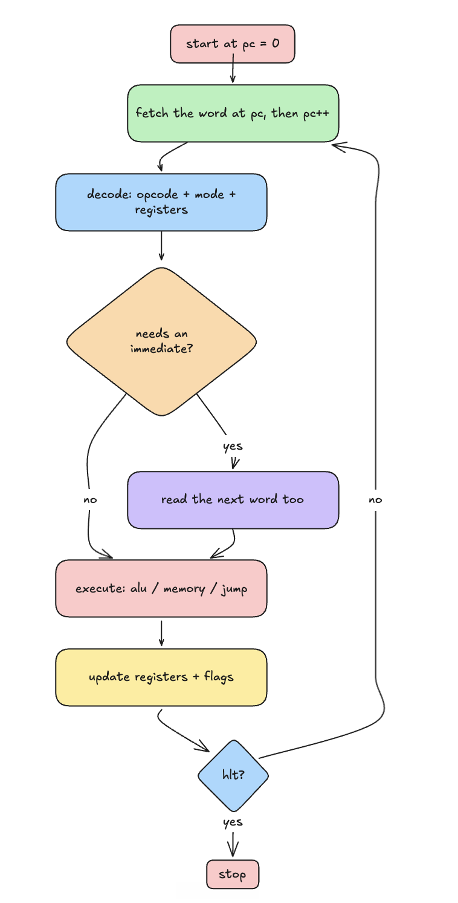

# cpucraft

a little 16-bit cpu that runs in the browser. you write assembly, it assembles it, and then it actually runs it step by step so you can watch the registers, memory and flags change as it goes. no backend, it's all client side.

i built this because i wanted to actually understand how a cpu works instead of just reading about fetch-decode-execute. turns out building one makes it stick a lot better.

## demo

https://github.com/user-attachments/assets/75a51971-899f-4574-9870-9cb3ba50b6db

a quick run-through: pick a program, assemble it, step through a few instructions, drop a breakpoint on a line, then let it run.

## running it

```bash
npm install
npm run dev
```

then open http://localhost:5173

build for prod with `npm run build`, run the tests with `npm test`.

## how it works

you type assembly in the editor. the assembler turns it into machine code (just an array of 16-bit numbers) and drops it into memory at address 0. then the cpu does the usual loop: read the instruction at pc, figure out what it is, do it, move pc forward, repeat until it hits `hlt`.

<p align="center">
  
</p>

the cpu loop itself is just:

1. fetch the word at pc, then pc++
2. decode it into opcode + addressing mode + register fields (and grab the next word if it's an immediate)
3. execute, update the registers and flags
4. go again, or stop on `hlt`

### instruction encoding

each instruction is 1 or 2 words (16 bits each):

```
word 0: [opcode:8][mode:2][regA:3][regB:3]
word 1: immediate / address   (only if it needs one)
```

modes: `0` reg,reg  `1` reg,imm  `2` reg,[addr]  `3` [addr],reg

### registers

- `r0`-`r7` general purpose, 16-bit
- `pc` program counter (which instruction is next)
- `sp` stack pointer, starts at 0xfffe and grows down
- `fl` flags: zero, carry, negative, overflow

## instructions

case doesn't matter, i just write everything lowercase. immediates can be decimal, hex (`0x..`), binary (`0b..`) or a char like `'a'`.

| op | form | what it does |
|----|------|--------------|
| mov | mov rd, rs/imm | copy a value into rd |
| add | add rd, rs/imm | rd = rd + operand, sets flags |
| sub | sub rd, rs/imm | rd = rd - operand, sets flags |
| mul | mul rd, rs/imm | rd = rd * operand |
| div | div rd, rs/imm | integer divide, halts on divide by zero |
| mod | mod rd, rs/imm | remainder, also halts on zero |
| neg | neg rd | negate (two's complement) |
| inc / dec | inc rd | +1 / -1 |
| and / or / xor | and rd, rs/imm | bitwise stuff |
| not | not rd | flip all the bits |
| shl / shr | shl rd, rs/imm | shift left / right |
| cmp | cmp rd, rs/imm | like sub but throws away the result, just sets flags |
| test | test rd, rs/imm | same idea but bitwise and |
| jmp | jmp label | jump always |
| jeq / jne | jeq label | jump if equal / not equal |
| jgt / jlt | jgt label | jump if greater / less |
| jge / jle | jge label | jump if greater-or-equal / less-or-equal |
| push / pop | push rs | stack |
| call / ret | call label | call a subroutine and come back |
| load | load rd, [addr/rs] | read memory into a register |
| store | store [addr/rs], rs | write a register into memory |
| swap | swap rd, rs | swap two registers |
| in | in rd | read the next number from the input queue (0 if empty) |
| out | out rs | print a register to the output |
| nop | nop | do nothing |
| hlt | hlt | stop |

## writing programs

- `;` starts a comment
- a word with a `:` is a label, like `loop:`
- `.data 1, 2, 3` drops raw values into memory
- `[addr]` or `[rs]` is indirect (go look at that memory address)

small example, a countdown loop:

```asm
  mov r0, 5
loop:
  out r0
  dec r0
  jne loop      ; keep going until r0 hits 0
  hlt
```

there are a few longer ones built in (hello world, fibonacci, bubble sort, summing the input queue) in the "load example" dropdown.

## the editor / debugger

- step one instruction at a time, or just run it (speed slider goes from slow to basically instant)
- click a line number to set a breakpoint, run stops there
- step over runs a whole `call` in one go instead of diving into it
- registers highlight when they change, memory shows the program counter, output shows decimal + hex
- save programs to the browser or download/upload them as `.asm`

## a few choices i made

- typescript + vite, mostly because the dev loop is fast and i wanted types while messing with the encoding
- memory is a `Uint16Array`, 64k words. simple and fast enough
- no webassembly. didn't need it, a 16-bit cpu in plain ts is plenty fast and the code stays readable
- the assembler is two passes (collect labels first, then resolve them) so you can jump to a label before it's defined

## tests

there's a [vitest](https://vitest.dev) suite covering the opcodes, flags, the assembler, the debugger, and running the example programs end to end and checking their actual output. ci runs build + tests on every push.

```bash
npm test
```

## license

mit
